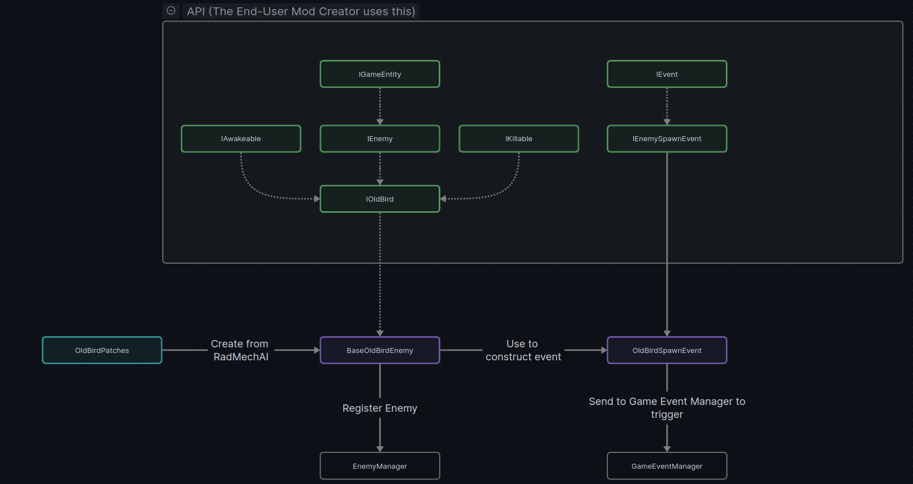

The **ContentLib API** for Lethal Company provides a streamlined, event-driven approach to modding. Rather than relying
on direct method extraction or patching, ContentLib abstracts in-game systems through interfaces. These interfaces,
such as `IPlayer`, `IBracken`, and `IScrap`, allow developers to interact with game entities without needing to delve
into the underlying implementation.

## Interfaces: Abstraction for In-Game Systems

Interfaces are the backbone of ContentLib, abstracting game entities and mechanics into a developer-friendly format.
By encapsulating functionality, these interfaces ensure mods remain decoupled from the game’s implementation details.

Examples include:
- `IGameEntity` representing any in-game entity (players or enemies).
- `IOldBird`, which abstracts the Old Bird enemy and provides methods to query its state or influence its behavior.
- `IEvent` and derivatives like `EnemySpawnEvent`, which represent in-game events that mods can listen to.

Interfaces are implemented within the Core API modules via Lethal Company patches. This approach reduces the need for
mods to rely on direct patches, creating a cleaner and less invasive workflow.

The API itself does not alter in-game behavior; it simply provides access to functionality in a more intuitive and
manageable way. Furthermore, the interface structure ensures that mods won’t require significant updates after a
game patch. 



## Lightweight Integration

ContentLib's modular design ensures that mods require only the API as a dependency, keeping them lightweight and
reducing complexity. This design allows modders to focus entirely on their desired functionality without worrying
about compatibility issues or conflicts.

## Event-Driven Architecture

At its core, ContentLib revolves around events. These events represent significant occurrences in the game, such as a
player jumping, an enemy spawning, or an item being activated. Developers can listen for these events and respond
dynamically.

For example, an `EnemyKillsPlayerEvent` might provide access to the enemy that killed the player via the `IEnemy` 
interface, along with the killed player via the `IPlayer` interface. 

With this information, a mod could check to see if the enemy is an instance of ```IBracken``` and, if so, kill the
Bracken if the player was in possession of a specific ```IGameItem```. 

For more information on the API's interface Structure, please refer to INSERT LINK HERE!

## Modding Workflow with ContentLib

To create a mod, developers typically define an event listener. Listeners are classes that implement the `IListener`
interface and include methods annotated with the `[EventDelegate]` attribute. These methods are automatically subscribed
to their corresponding events.

Here’s an example of a listener for a `PlayerJumpEvent`:

```cs
[EventDelegate]
private void OnPlayerJump(PlayerJumpEvent playerJumpEvent)
{
    IPlayer player = playerJumpEvent.Player;
    player.TeleportToShip();
}
```

Whenever a player jump occurs, this method is triggered, allowing developers to dynamically alter gameplay behavior.

## Simple Example: Creating a Portable Teleporter Listener

Using ContentLib, you can implement a mod where activating a specific item teleports the player to their ship. 
Here's a straightforward implementation:

```cs
[EventDelegate]
private void OnItemActivation(ItemActivationEvent itemActivationEvent)
{
    IGameItem item = itemActivationEvent.Item;
    if (item is IRemoteControlScrap && item.Owner is IPlayer player)
    {
        player.TeleportToShip();
    }
}
```

This example listens for ```ItemActivationEvent```, checks if the activated item is an instance of 
```IRemoteControlScrap```, and teleports the player to their ship if the condition is met.

For more information on how to create / register listeners, please refer to INSERT LINK HERE!